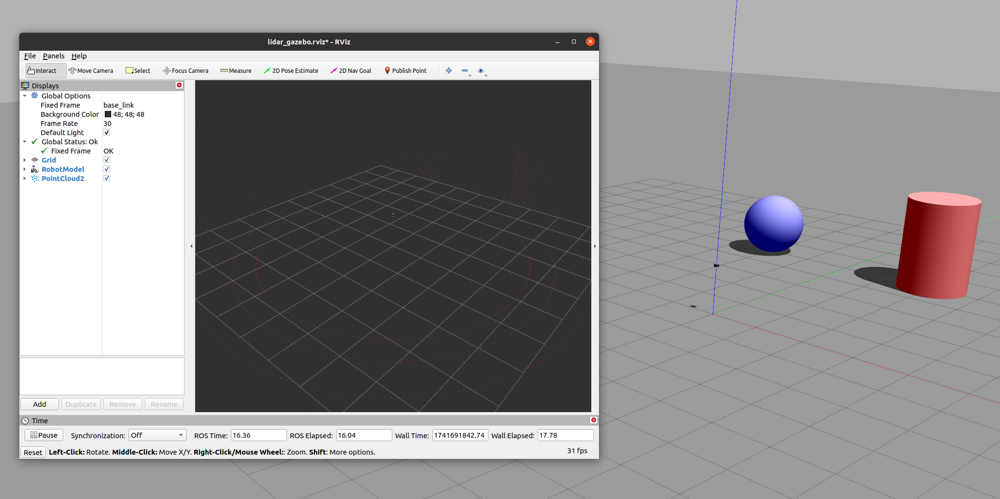
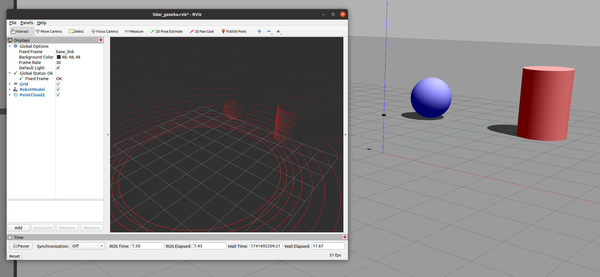
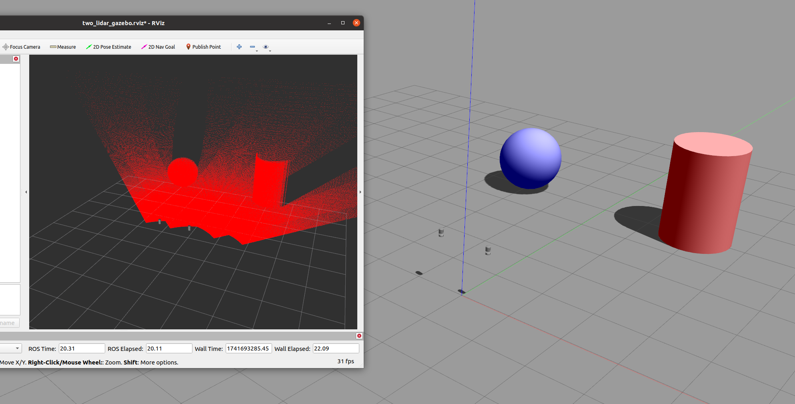
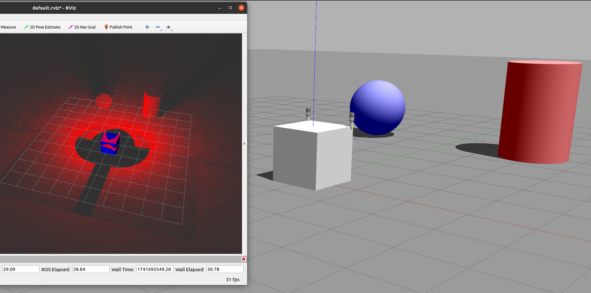

# gazebo加载环境，多线激光雷达采集数据

**multi-line lidar simulation in gazebo**

**这个demo主要是用来帮助你，短期内搭建一个简单的多线激光雷达采集数据的仿真环境。**


---

> 注意事项：

> - 这边我尝试过了，搞多线激光雷达采集数据，你需要用到gpu，否则只是使用cpu的话，ros加载雷达的线数的时候，会崩掉。
> - 对于多线激光雷达，我这边使用的是Velodyne的雷达仿真包。

# `world`目录
## `my_world.world`

这个文件定义了仿真环境，里面加载了两个物体，一个是圆柱体，一个是球体。

> - 由于没有绑定固定关节，在仿真环境刚打开的时候，这两个物体会由于重力原因下落。
> - 注意这里的距离是以物体的几何中心计算的，而不是表面。

# `launch`目录
## launch/run_lidar_gazebo.launch

这里使用的就是VLP-16的雷达，你可以在`velodyne_description/urdf`目录下找到对应的雷达模型。




这是仿真中的相关参数，可以进行修改
```xml
  <xacro:macro name="VLP-16" params="
    *origin
    parent:=base_link 
    name:=velodyne 
    topic:=/velodyne_points 
    hz:=10
    lasers:=16 
    samples:=1875 
    collision_range:=0.3 
    min_range:=0.9 
    max_range:=130.0 
    noise:=0.008 
    min_angle:=-${M_PI} 
    max_angle:=${M_PI} 
    gpu:=false">
```
比如我把线数改成32，结果如下。



## launch/run_two_lidar_gazebo.launch

这个就是使用了HDL-32E的雷达，你可以在`velodyne_description/urdf`目录下找到对应的雷达模型。

然后我在里面添加了指定角度，此时大概率就需要使用gpu，否则就会崩掉。




## launch/run_two_lidar_gazebo_demo.launch
如果你需要将雷达绑定在某个物体上，你可以按照我下面的做法。

我定义了一个大的正方体，然后在正方体的两侧，放了两个圆柱体，雷达分别绑在两个圆柱体上。




# `urdf`目录

## urdf/xacro/lidar.xacro
这只是将雷达悬空起来放置。

```xml
  <link name="world"/>
  <joint name="world_fixed" type="fixed">
    <parent link="world"/>
    <child link="base_link"/>
    <origin xyz="0 0 0" rpy="0 0 0"/>
  </joint>
```
**这些内容是需要的，如果没有，就会导致雷达会掉在地上，无法模拟雷达在指定高度。**

这是我在实践中得到的结论。希望大家能够注意到。

# 如何实现整个步骤

**这是我今天遇到的一个问题，就是，如何实现这样的一个简单的仿真demo。**

**我发现，过了一段时间后，全部忘记了，因此我在这里记录一下。**

1. 比如我这里使用的是velodyne的仿真包。我需要知道他里面的雷达模型。
2. 编写环境文件，在里面搭建好环境，比如我这里的`my_world.world`文件。
3. 当然，你也可以将环境搭建在`urdf`文件中。比如在`lidar.xacro`文件中，编写圆柱体和球体的模型。原理也是一样的。
4. 最重要的就是，你需要有一个总的`urdf/xacro`文件，去把雷达文件，你在urdf文件中添加的一些模型，全部导入进来。
5. 编写launch文件，在里面加载环境，加载集成你所有内容的那个总的`urdf/xacro`文件。


# 最后
剩下的需要大家自己去探索了。

我在进行多线激光雷达仿真的时候，也遇到过很多很多问题。


